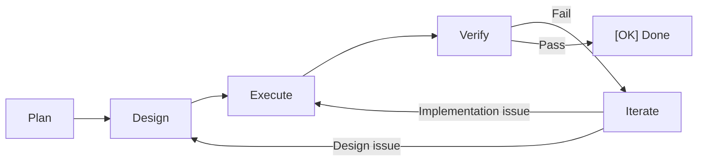

> **语言 / Language**: [简体中文](README.md) · **English**

<div align="center">
  

  # DevCrew

  **Give AI a collaboration protocol. Let it work like a real team.**

  *帮你做好 harness！*

  [](https://www.npmjs.com/package/@lordmos/dev-crew)
  [](LICENSE)
  [](https://nodejs.org)
  [](https://github.com/lordmos/dev-crew/pulls)

</div>

---

## The Problem

When using AI (Copilot, Claude, Cursor…) for development:

| Problem | What happens |
|---------|-------------|
| **No memory** | Switch conversations, AI forgets everything |
| **No division of labor** | AI plays PM + architect + dev + tester simultaneously |
| **Goes off track** | Drifts from goals with no checkpoints to correct course |
| **Quality blind spots** | No review process — bugs and tech debt accumulate silently |
| **No starting point** | Don't know how to orchestrate AI collaboration |

**Root cause**: AI lacks a persistent collaboration protocol. DevCrew is that protocol.

---

## Get Started in 30 Seconds

```bash
npx skills add lordmos/dev-crew
```

> Compatible with 44+ AI platforms (Claude Code, GitHub Copilot, Cursor, Codex, etc.). Automatically installs the DevCrew protocol into your agent. See [skills.sh](https://skills.sh).

After install, use `/crew-init` in your AI chat to initialize the workspace and start immediately.

---

## How It Works

```
You: I need to add auth middleware to the API

AI:  [PdM] Creating change add-api-auth, mode: Standard
     Plan — Requirements:
     - Goal: Add JWT auth to all /api/ routes
     - Acceptance: [ ] No token → 401  [ ] Expired token → 401
     Please confirm.

You: Confirmed

AI:  Design → Execute → Verify — All passed. Please confirm acceptance.

You: Confirmed

AI:  [OK] Change add-api-auth complete.
```

**You only confirmed twice** (requirements + results). Everything else was automatic.

---

## What `/crew-init` Creates

> After installing Skills, type `/crew-init` in your AI chat to initialize.

```
your-project/
├── INSTRUCTIONS.md    ← AI behavior instructions (core file)
├── dev-crew.yaml       ← Project config (modes, specialists)
└── dev-crew/
    ├── specs/         ← Shared specifications
    └── memory/        ← Agent long-term memory (auto-accumulated)
```

AI reads `INSTRUCTIONS.md` and PjM orchestrates the team — agents collaborate in parallel following the PDEVI workflow.

---

## Core Concepts

### PDEVI Workflow



Three modes for every scenario:

| Mode | Flow | Best for |
|------|------|----------|
| **Standard** | P → D → E → V → I | New features, refactoring |
| **Express** | P → E → V | Bug fixes |
| **Prototype** | P → D → E | Quick prototyping |

### On-Demand Team Assembly

PjM creates agents on demand based on user needs. Common roles:

| Agent | Responsibility |
|-------|---------------|
| **PjM** Project Manager | Task decomposition, agent coordination, progress tracking |
| **PdM** Product Manager | Requirements analysis, PRD import, acceptance criteria |
| **Architect** | Tech decisions, task decomposition, dependency analysis |
| **Implementer** | Code generation, refactoring, dependency management |
| **Tester** | Test execution, acceptance checks, coverage |
| **Reviewer** | Code review, security scanning, best practices |

> Team size is flexible — PjM creates additional agents (e.g., DBA, Tech Writer, SRE) as needed, no manual assignment required.

### Domain Specialists (29)

Beyond the core team, **29 domain specialists** across 10 fields, activated on demand:

> Game Dev (8) · UI/UX (3) · Security (1) · DevOps (3) · Testing (3) · Engineering (5) · Data (2) · AI/ML (1) · Web3 (1) · Spatial Computing (2)

```yaml
# dev-crew.yaml
specialists:
  - game-designer
  - security-engineer
```

```bash
/crew-agents  # View all available specialists in your AI chat
```

> See the full [Specialist Directory](agents/README.md)

---

## Skills

After install, use these skills in your AI chat:

| Skill | Invoke | Purpose |
|-------|--------|---------|
| **init** | `/crew-init` | Initialize workspace + agent memory files |
| **plan** | `/crew-plan` | Create a change and start working |
| **status** | `/crew-status` | Check current progress |
| **checkpoint** | `/crew-checkpoint` | Phase audit + consistency check + memory sync |
| **release** | `/crew-release` | Archive changes + consolidate memory |
| **agents** | `/crew-agents` | List available specialists |

> Natural language works too — "run a checkpoint" triggers the checkpoint skill automatically

---

## Use Cases

| Scenario | You say | DevCrew does |
|----------|---------|-------------|
| Greenfield | "I have an idea, build from scratch" | Init → guide requirements → Standard |
| Existing PRD | "Here's the PRD, execute it" | Import PRD → refine → Standard |
| Mid-project | "Code exists, help me continue" | Scan code → establish baseline → Standard |
| Brainstorm | "Let's discuss the approach" | Explore mode (no code changes) |
| Bug fix | "There's a bug, fix it fast" | Express mode |
| Refactor | "This code needs refactoring" | Standard (full workflow) |
| Prototype | "Build a quick prototype first" | Prototype mode |
| Learn codebase | "Help me understand this code" | Explore mode (code analysis) |

---

## Architecture

```
┌─────────────────────────────────────────────────────┐
│  Access Layer                                        │
│  ┌───────────────────────┐ ┌───────────────────────┐ │
│  │ Agent Skills          │ │ MCP Server            │ │
│  │ /crew-init            │ │ crew_*                │ │
│  │ /crew-plan ...        │ │                       │ │
│  └───────────────────────┘ └───────────────────────┘ │
├─────────────────────────────────────────────────────┤
│  Protocol Layer (core, zero tool dependency)         │
│  INSTRUCTIONS.md · PDEVI workflow ·                  │
│  File conventions · Communication rules              │
└─────────────────────────────────────────────────────┘
```

> Two access methods: install to any agent via `npx skills add` (recommended), or call programmatically via MCP Server. Even without any tools, manually placing `INSTRUCTIONS.md` works.

---

## Documentation

| Doc | Description |
|-----|-------------|
| [Quick Start](docs/en/quick-start.md) | Install, init, first use |
| [Guide](docs/en/guide.md) | Skills, work modes, team, config |
| [Use Cases](docs/en/scenarios.md) | 8 scenarios + FAQ |
| [Core Concepts](docs/en/concepts.md) | PDEVI workflow, files as memory |
| [Specialists](agents/README.md) | 29 specialists · 10 domains |
| [Best Practices](docs/en/examples/) | Scenario walkthrough examples |

## Contributing

Contributions welcome! See [CONTRIBUTING.md](CONTRIBUTING.md).

## License

[MIT](LICENSE)

## Credits

Domain specialists adapted from the [agency-agents-zh](https://github.com/jnMetaCode/agency-agents-zh) project.
