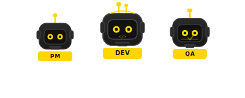
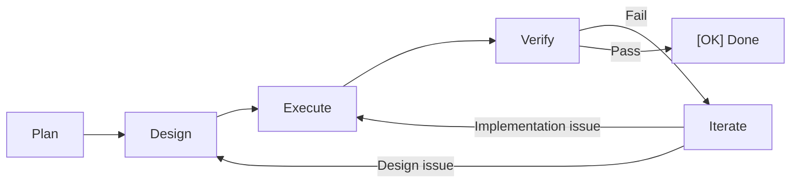

> **语言 / Language**: [简体中文](README.md) · **English**

<div align="center">
  

  # DevCrew

  **Give AI a collaboration protocol. Let it work like a real team.**

  *帮你做好 harness！*

  [](https://www.npmjs.com/package/@lordmos/dev-crew)
  [](LICENSE)
  [](https://nodejs.org)
  [](https://github.com/lordmos/dev-crew/pulls)

</div>

---

## The Problem

When using AI (Copilot, Claude, Cursor…) for development:

| Problem | What happens |
|---------|-------------|
| **No memory** | Switch conversations, AI forgets everything |
| **No division of labor** | AI plays PM + architect + dev + tester simultaneously |
| **Goes off track** | Drifts from goals with no checkpoints to correct course |
| **Quality blind spots** | No review process — bugs and tech debt accumulate silently |
| **No starting point** | Don't know how to orchestrate AI collaboration |

**Root cause**: AI lacks a persistent collaboration protocol. DevCrew is that protocol.

---

## Get Started in 30 Seconds

```bash
npm install -g @lordmos/dev-crew
cd your-project
crew init
```

Three steps — your project now has a **ready-to-use 6-person AI dev team** + **29 optional domain specialists**, fully auto-orchestrated.

Works with **GitHub Copilot · Claude · ChatGPT · Cursor** and any AI platform.

---

## How It Works

```
You: I need to add auth middleware to the API

AI:  [PdM] Creating change add-api-auth, mode: Standard
     Plan — Requirements:
     - Goal: Add JWT auth to all /api/ routes
     - Acceptance: [ ] No token → 401  [ ] Expired token → 401
     Please confirm.

You: Confirmed

AI:  Design → Execute → Verify — All passed. Please confirm acceptance.

You: Confirmed

AI:  [OK] Change add-api-auth complete.
```

**You only confirmed twice** (requirements + results). Everything else was automatic.

---

## What `crew init` Creates

```
your-project/
├── INSTRUCTIONS.md    ← AI behavior instructions (core file)
├── dev-crew.yaml       ← Project config (modes, specialists)
└── dev-crew/
    ├── specs/         ← Shared specifications
    └── memory/        ← Agent long-term memory (auto-accumulated)
```

AI reads `INSTRUCTIONS.md` and PjM orchestrates the team — agents collaborate in parallel following the PDEVI workflow.

---

## Core Concepts

### PDEVI Workflow



Three modes for every scenario:

| Mode | Flow | Best for |
|------|------|----------|
| **Standard** | P → D → E → V → I | New features, refactoring |
| **Express** | P → E → V | Bug fixes |
| **Prototype** | P → D → E | Quick prototyping |

### Built-in Team (6 Agents)

| Agent | Responsibility |
|-------|---------------|
| **PjM** Project Manager | Task decomposition, agent coordination, progress tracking |
| **PdM** Product Manager | Requirements analysis, PRD import, acceptance criteria |
| **Architect** | Tech decisions, task decomposition, dependency analysis |
| **Implementer** | Code generation, refactoring, dependency management |
| **Tester** | Test execution, acceptance checks, coverage |
| **Reviewer** | Code review, security scanning, best practices |

PjM orchestrates the entire team — multiple agents work in parallel, no manual assignment needed.

### Domain Specialists (29)

Beyond the core team, **29 domain specialists** across 10 fields, activated on demand:

> Game Dev (8) · UI/UX (3) · Security (1) · DevOps (3) · Testing (3) · Engineering (5) · Data (2) · AI/ML (1) · Web3 (1) · Spatial Computing (2)

```yaml
# dev-crew.yaml
specialists:
  - game-designer
  - security-engineer
```

```bash
crew agents  # List all available specialists
```

> See the full [Specialist Directory](agents/README.md)

---

## Skill Commands

| Command | Purpose |
|---------|---------|
| `/crew:init` | Initialize workspace |
| `/crew:plan <name>` | Create a change and start working |
| `/crew:status` | Check current progress |
| `/crew:explore` | Discuss / analyze (no code changes) |
| `/crew:release` | Archive completed changes |

> Natural language works too — "show me the progress" = `/crew:status`

---

## Use Cases

| Scenario | You say | DevCrew does |
|----------|---------|-------------|
| Greenfield | "I have an idea, build from scratch" | Init → guide requirements → Standard |
| Existing PRD | "Here's the PRD, execute it" | Import PRD → refine → Standard |
| Mid-project | "Code exists, help me continue" | Scan code → establish baseline → Standard |
| Brainstorm | "Let's discuss the approach" | `/crew:explore` (no code changes) |
| Bug fix | "There's a bug, fix it fast" | Express mode |
| Refactor | "This code needs refactoring" | Standard (full workflow) |
| Prototype | "Build a quick prototype first" | Prototype mode |
| Learn codebase | "Help me understand this code" | `/crew:explore` (code analysis) |

---

## Architecture

```
┌─────────────────────────────────────────────┐
│  Tool Layer                                  │
│  ┌──────────────┐  ┌──────────────────────┐ │
│  │ CLI          │  │ Agent Skill          │ │
│  │ crew init    │  │ INSTRUCTIONS.md      │ │
│  │ crew agents  │  │ /crew: commands      │ │
│  └──────────────┘  └──────────────────────┘ │
├─────────────────────────────────────────────┤
│  Protocol Layer (core, zero tool dependency) │
│  Directory conventions · File formats ·      │
│  PDEVI workflow · Communication rules        │
└─────────────────────────────────────────────┘
```

> Even without CLI, manually placing `INSTRUCTIONS.md` works. CLI just makes it easier.

---

## Documentation

| Doc | Description |
|-----|-------------|
| [User Manual](docs/USER-MANUAL.md) | Detailed guide for 8 scenarios |
| [Best Practices](docs/examples/) | Scenario walkthrough examples |
| [Specialists](agents/README.md) | 29 specialists · 10 domains |

## Contributing

Contributions welcome! See [CONTRIBUTING.md](CONTRIBUTING.md).

## License

[MIT](LICENSE)

## Credits

Domain specialists adapted from the [agency-agents-zh](https://github.com/jnMetaCode/agency-agents-zh) project.
