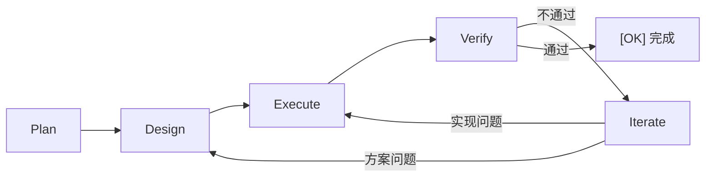

> **语言 / Language**: **简体中文** · [English](README.en.md)

<div align="center">
  

  # DevCrew

  **给 AI 一套协作协议，让它像真正的团队一样工作。**

  *帮你做好 harness！*

  [](https://www.npmjs.com/package/@lordmos/dev-crew)
  [](LICENSE)
  [](https://nodejs.org)
  [](https://github.com/lordmos/dev-crew/pulls)

</div>

---

## 痛点

用 AI（Copilot、Claude、Cursor…）辅助开发时，你是否遇到过：

| 问题 | 表现 |
|------|------|
| **无记忆** | 换个对话窗口，AI 忘了之前做了什么 |
| **无分工** | AI 同时充当 PM + 架构师 + 开发 + 测试，顾此失彼 |
| **会跑偏** | 做着做着偏离目标，没有检查点纠正 |
| **质量盲区** | 没有审查环节，bug 和技术债悄悄积累 |
| **不知从何开始** | 面对新项目，不知道如何编排 AI 协作 |

**根因**：AI 缺少一套持久化的协作协议。DevCrew 就是那套协议。

---

## 30 秒上手

```bash
npx skills add lordmos/dev-crew
```

> 兼容 44+ AI 平台（Claude Code、GitHub Copilot、Cursor、Codex 等），自动将 DevCrew 协议安装到你的 Agent。详见 [skills.sh](https://skills.sh)。

安装后在 AI 对话中使用 `/crew.init` 初始化工作区，即刻开始。

---

## 它是怎么工作的

```
你: 我要给 API 加认证中间件

AI: [PdM] 创建变更 add-api-auth，模式: Standard
    Plan — 需求整理:
    - 目标: 为所有 /api/ 路由添加 JWT 认证
    - 验收标准: [ ] 未携带 token 返回 401  [ ] 过期 token 返回 401
    请确认。

你: 确认

AI: Design → Execute → Verify — 全部通过。请确认验收。

你: 确认

AI: [OK] 变更 add-api-auth 完成。
```

**你只确认了两次**（需求 + 结果），其余全部自动。

---

## `/crew.init` 做了什么

> 安装 Skills 后，在 AI 对话中输入 `/crew.init` 即可执行初始化。

```
your-project/
├── INSTRUCTIONS.md    ← AI 行为指令（核心文件）
├── dev-crew.yaml      ← 项目配置（模式、专家选择）
└── dev-crew/
    ├── specs/         ← 共享规约
    └── memory/        ← Agent 长期记忆（自动积累）
```

AI 读取 `INSTRUCTIONS.md` 后，PjM 自动编排团队，各 Agent 按 PDEVI 流程平行协作。

---

## 核心概念

### PDEVI 工作流



三种模式，覆盖所有场景：

| 模式 | 流程 | 适用 |
|------|------|------|
| **Standard** | P → D → E → V → I | 新功能、重构 |
| **Express** | P → E → V | Bug 修复 |
| **Prototype** | P → D → E | 快速原型 |

### 按需组建团队

PjM 根据用户需求按需创建 Agent，常见角色：

| Agent | 职责 |
|-------|------|
| **PjM** 项目经理 | 任务拆解、Agent 调度、进度协调 |
| **PdM** 产品经理 | 需求梳理、PRD 导入、验收标准 |
| **Architect** 架构师 | 技术选型、任务分解、依赖分析 |
| **Implementer** 开发 | 代码生成、重构、依赖安装 |
| **Tester** 测试 | 测试执行、验收检查、覆盖率 |
| **Reviewer** 审查 | 规范检查、安全扫描、最佳实践 |

> 团队规模不固定，PjM 按需创建更多 Agent（如 DBA、技术文档、运维），无需手动分配。

### 领域专家（29 位）

另有 **29 位领域专家**覆盖 10 个领域，按需激活：

> 游戏开发（8）· UI/UX（3）· 安全（1）· DevOps（3）· 测试（3）· 工程（5）· 数据（2）· AI/ML（1）· Web3（1）· 空间计算（2）

```yaml
# dev-crew.yaml
specialists:
  - game-designer
  - security-engineer
```

```bash
/crew.agents  # 在 AI 对话中查看所有可用专家
```

> 完整列表见 [领域专家目录](agents/README.md)

---

## Skills

安装后即可在 AI 对话中使用以下 Skill：

| Skill | 调用方式 | 用途 |
|-------|---------|------|
| **init** | `/crew.init` | 初始化工作区 + Agent 记忆文件 |
| **plan** | `/crew.plan` | 创建变更并开始工作 |
| **status** | `/crew.status` | 查看当前进度 |
| **checkpoint** | `/crew.checkpoint` | 阶段审计 + 一致性检查 + 记忆同步 |
| **release** | `/crew.release` | 归档变更 + 记忆整合 |
| **agents** | `/crew.agents` | 列出可用领域专家 |

> 自然语言同样有效——"做个检查点"，AI 自动调用 checkpoint skill

---

## 使用场景

| 场景 | 你说 | DevCrew 做 |
|------|------|------------|
| 从零开始 | "有个想法，从零构建" | 初始化 → 引导需求 → Standard |
| 已有 PRD | "需求文档在这，执行吧" | 导入 PRD → 提炼 → Standard |
| 中途接入 | "代码已有，帮我续上" | 扫描代码 → 建基线 → Standard |
| 头脑风暴 | "讨论一下方案" | 探索模式（不改代码） |
| Bug 修复 | "有个 bug，快修" | Express 模式 |
| 代码重构 | "这段代码要重构" | Standard 完整流程 |
| 快速原型 | "先做个原型验证" | Prototype 模式 |
| 学习代码库 | "帮我理解这段代码" | 探索模式（分析代码） |

---

## 架构

```
┌─────────────────────────────────────────────────────┐
│  接入层                                              │
│  ┌───────────────────────┐ ┌───────────────────────┐ │
│  │ Agent Skills          │ │ MCP Server            │ │
│  │ /crew.init            │ │ crew_*                │ │
│  │ /crew.plan ...        │ │                       │ │
│  └───────────────────────┘ └───────────────────────┘ │
├─────────────────────────────────────────────────────┤
│  协议层（核心，零工具依赖）                            │
│  INSTRUCTIONS.md · PDEVI 工作流 · 文件约定             │
└─────────────────────────────────────────────────────┘
```

> 两种接入方式：通过 `npx skills add` 安装到任意 Agent（推荐）、通过 MCP Server 程序化调用。即使不装任何工具，手动放入 `INSTRUCTIONS.md` 也能工作。

---

## 文档

| 文档 | 说明 |
|------|------|
| [快速开始](docs/quick-start.md) | 安装、初始化、第一次使用 |
| [使用指南](docs/guide.md) | Skills、工作模式、团队、配置 |
| [使用场景](docs/scenarios.md) | 8 种场景详解 + 常见问题 |
| [核心概念](docs/concepts.md) | PDEVI 工作流、文件即记忆 |
| [领域专家](agents/README.md) | 29 位专家 · 10 个领域 |
| [最佳实践](docs/examples/) | 场景串联示例 |

## 贡献

欢迎参与！详见 [CONTRIBUTING.md](CONTRIBUTING.md)。

## 许可证

[MIT](LICENSE)

## 致谢

领域专家部分基于 [agency-agents-zh](https://github.com/jnMetaCode/agency-agents-zh) 项目改编。
