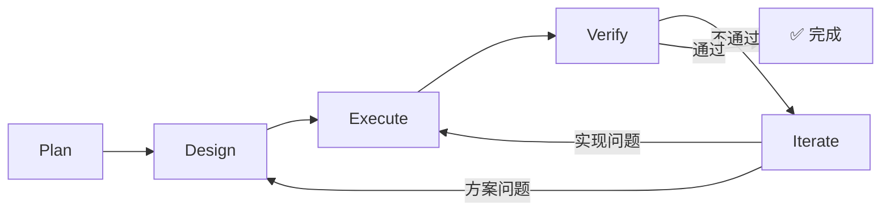
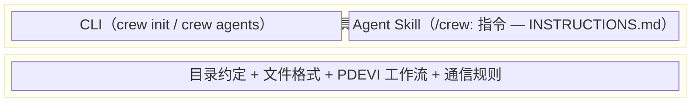

# DevCrew

**AI Agent 软件开发团队编排框架 — 开箱即用的 CLI + Skill 工具**

> 一条命令，一个完整的 AI 软件开发团队。

---

## 新人会遇到什么问题？

用 AI（Copilot、Claude、Cursor…）辅助开发时：

- 🧠 **无记忆** — 换个对话窗口，AI 忘了之前做了什么
- 🎭 **无分工** — AI 同时充当 PM + 架构师 + 开发 + 测试，顾此失彼
- 🎯 **会跑偏** — 做着做着偏离目标，没有检查点纠正
- 🔍 **质量盲区** — 没有审查环节，bug 和技术债悄悄积累
- ❓ **最重要的：不知道从哪儿开始** — 没有做过AI辅助开发，或者不知道如何合理编排

**根因**：AI 缺少一套持久化的协作协议。

## DevCrew提供了什么

```bash
npm install -g devcrew
cd your-project
crew init
```

三步完成。你的项目现在有了一个**开箱即用的 6 人 AI 开发团队** + **29 位可选领域专家**，全部自动编排。

```
你: 我要给 API 加认证中间件
AI: 📋 创建变更 add-api-auth，模式: Standard
    
    Plan — 需求整理:
    - 目标: 为所有 /api/ 路由添加 JWT 认证
    - 验收标准: ☐ 未携带 token 返回 401 ☐ 过期 token 返回 401
    请确认。

你: 确认
AI: Design — 技术方案 → Execute — 编码实现 → Verify — 全部通过。
    请确认验收。

你: 确认
AI: ✅ 变更 add-api-auth 完成。
```

**整个过程你只确认了两次**（需求 + 结果），其余全部自动。

---

## 安装

```bash
npm install -g devcrew
```

> 需要 Node.js 18+

## 快速开始

```bash
# 1. 在项目中初始化 DevCrew
cd your-project
crew init

# 2. 打开任意 AI 对话工具，开始工作
#    AI 会自动读取 INSTRUCTIONS.md，建立团队，执行 PDEVI 流程
```

`crew init` 会创建：

```
your-project/
├── INSTRUCTIONS.md          ← AI 行为指令（核心文件，AI 读取这个文件就知道怎么协作）
├── devcrew.yaml             ← 项目配置（模式、专家等，入库）
└── devcrew/
    └── specs/               ← 共享规约
```

> 适用于 GitHub Copilot、Claude、ChatGPT、Cursor 等任何 AI 平台。

---

## 核心概念

### 文件即记忆 · 协议即流程 · 团队即内建

| 概念 | 一句话 |
|------|--------|
| **变更** | 一个开发任务（如"添加用户认证"、"修复空指针"） |
| **PDEVI** | Plan → Design → Execute → Verify → Iterate 工作流 |
| **模式** | Standard（完整）/ Express（修 bug）/ Prototype（试验） |
| **Blocker** | AI 搞不定，需要你决策 |

### PDEVI 工作流



| 模式 | 流程 | 适用 |
|------|------|------|
| **Standard** | P → D → E → V → I | 新功能、重构 |
| **Express** | P → E → V | Bug 修复（跳过 Design） |
| **Prototype** | P → D → E | 快速原型（跳过 Verify + Iterate） |

### Skill 指令

安装后 AI 自动识别以下指令：

| 指令 | 用途 |
|------|------|
| `/crew:init` | 初始化工作区（等同 CLI `crew init`） |
| `/crew:plan <名称>` | 创建变更并开始工作 |
| `/crew:status` | 查看进度 |
| `/crew:explore` | 讨论/分析，不改代码 |
| `/crew:release` | 归档已完成变更 |

> 自然语言同样有效——"帮我看看进度" = `/crew:status`。

---

## 内建团队

| 角色 | 职责 | Skill |
|------|------|-------|
| 🎯 **PjM** 项目经理 | 调度编排 | 模式推断、阶段推进、安全阀、会话恢复 |
| 📋 **PdM** 产品经理 | 需求分析 | 需求梳理、PRD 导入、验收标准 |
| 🏗️ **Architect** 架构师 | 技术方案 | 技术选型、任务分解、依赖分析 |
| 💻 **Implementer** 开发 | 编码实现 | 代码生成、重构、依赖安装 |
| 🧪 **Tester** 测试 | 验证质量 | 测试执行、验收检查、覆盖率 |
| 👀 **Reviewer** 审查 | 代码审查 | 规范检查、安全扫描、最佳实践 |

> 角色切换完全自动，你不需要手动分配或调度。

## 领域专家

核心团队之外，**29 位领域专家**覆盖 10 个领域，按需激活：

🎮 游戏开发（8）· 🎨 UI/UX（3）· 🔒 安全（1）· ⚙️ DevOps（3）· 🧪 测试（3）· 💻 工程（5）· 📊 数据（2）· 🤖 AI/ML（1）· 🌐 Web3（1）· 🥽 空间计算（2）

```yaml
# devcrew.yaml — 按需激活
specialists:
  - game-designer
  - security-engineer
```

```bash
# 查看所有可用专家
crew agents
```

> 详见 [领域专家目录](agents/README.md)

---

## 8 种场景

| 场景 | 你说 | DevCrew 做 |
|------|------|-------------|
| 从零开始 | "有个想法，从零构建" | 初始化 → 引导需求 → Standard |
| 已有 PRD | "需求文档在这，执行吧" | 导入 PRD → 提炼 → Standard |
| 中途接入 | "代码已有，帮我续上" | 扫描代码 → 建基线 → Standard |
| 头脑风暴 | "讨论一下方案" | `/crew:explore`（不改代码） |
| Bug 修复 | "有个 bug，快修" | Express（跳过 Design） |
| 代码重构 | "这段代码要重构" | Standard（完整流程） |
| 快速原型 | "先做个原型验证" | Prototype（跳过 Verify） |
| 学习代码库 | "帮我理解这段代码" | `/crew:explore`（分析代码） |

---

## 架构



| 层 | 是什么 | 依赖 |
|----|--------|------|
| **协议层** | 基于文件系统 + Markdown 的协作协议 | 无 |
| **工具层 — Skill** | `INSTRUCTIONS.md` — AI 读取后自动遵循协议 | 协议层 |
| **工具层 — CLI** | `crew` 命令 — 初始化、管理 | 协议层 |

> 即使不装 CLI，手动放入 `INSTRUCTIONS.md` 也能工作。CLI 只是让流程更方便。

---

## CLI 命令

| 命令 | 说明 |
|------|------|
| `crew init` | 初始化项目（创建 INSTRUCTIONS.md + devcrew.yaml + devcrew/） |
| `crew agents` | 列出所有可用的领域专家 |

> 更多命令将在后续版本中添加。

---

## 文档

| 文档 | 说明 |
|------|------|
| [用户手册](docs/USER-MANUAL.md) | 8 种场景使用指南 |
| [最佳实践](docs/examples/) | 场景串联示例 |
| [领域专家](agents/README.md) | 29 位专家 · 10 个领域包 |

## 贡献

欢迎参与！详见 [CONTRIBUTING.md](CONTRIBUTING.md)。

## 许可证

[MIT](LICENSE)

## 致谢

领域专家部分基于 [agency-agents-zh](https://github.com/jnMetaCode/agency-agents-zh) 项目改编。
