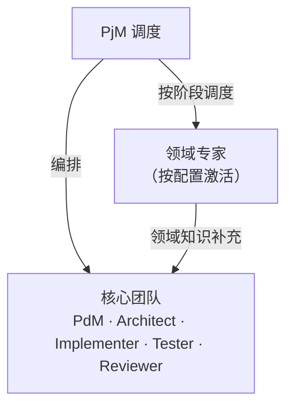

# 领域专家目录

> 共 **29** 位专家 · **10** 个领域包

DevCrew 内建 6 个核心角色（PjM/PdM/Architect/Implementer/Tester/Reviewer）。领域专家是**可选的补充角色**——为特定项目类型提供专业知识，增强核心团队的领域深度。

## 使用方式

```yaml
# dev-crew.yaml
specialists:
  - game-designer      # 按需激活
  - ui-designer
  - security-engineer
```

PjM 在 `/crew:init` 时读取配置，加载对应专家 prompt，在 PDEVI 的相关阶段自动参与。每个专家独立，可自由组合。

---

## 专家速查表

### 🎮 游戏开发（8）

| 专家 | 文件 | 阶段 | 核心能力 |
|------|------|------|---------|
| 游戏设计师 | [`game-designer.md`](game-designer.md) | P·D·V | GDD、游戏循环、经济平衡 |
| 关卡设计师 | [`level-designer.md`](level-designer.md) | D·E·V | 关卡节奏、空间叙事、难度曲线 |
| 叙事设计师 | [`narrative-designer.md`](narrative-designer.md) | P·D·V | 剧情架构、对话系统、分支叙事 |
| 技术美术 | [`technical-artist.md`](technical-artist.md) | D·E·V | Shader、性能美术、管线工具 |
| 游戏音频工程师 | [`game-audio-engineer.md`](game-audio-engineer.md) | D·E·V | 自适应音频、Wwise/FMOD、空间音效 |
| Unity 专家 | [`unity-specialist.md`](unity-specialist.md) | D·E·V | DOTS/ECS、URP/HDRP、Addressables |
| Godot 专家 | [`godot-specialist.md`](godot-specialist.md) | D·E·V | GDScript/C#、Scene 树、信号系统 |
| Unreal 专家 | [`unreal-specialist.md`](unreal-specialist.md) | D·E·V | Blueprint/C++、GAS、Nanite/Lumen |

### 🎨 UI/UX 设计（3）

| 专家 | 文件 | 阶段 | 核心能力 |
|------|------|------|---------|
| UI 设计师 | [`ui-designer.md`](ui-designer.md) | D·E·V | 设计系统、组件库、响应式 |
| UX 架构师 | [`ux-architect.md`](ux-architect.md) | P·D·V | 信息架构、用户流程、可用性 |
| UX 研究员 | [`ux-researcher.md`](ux-researcher.md) | P·D·V | 用研方法、可用性测试、数据洞察 |

### 🔒 安全（1）

| 专家 | 文件 | 阶段 | 核心能力 |
|------|------|------|---------|
| 安全工程师 | [`security-engineer.md`](security-engineer.md) | D·E·V | 威胁建模、OWASP、安全审查 |

### ⚙️ DevOps & 可靠性（3）

| 专家 | 文件 | 阶段 | 核心能力 |
|------|------|------|---------|
| DevOps 工程师 | [`devops-engineer.md`](devops-engineer.md) | D·E·V | CI/CD、容器化、IaC、监控 |
| SRE | [`sre.md`](sre.md) | D·E·V | SLO/错误预算、混沌工程、容量规划 |
| 事件响应指挥官 | [`incident-response-commander.md`](incident-response-commander.md) | E·V | 事件分级、根因分析、Runbook |

### 🧪 测试 & QA（3）

| 专家 | 文件 | 阶段 | 核心能力 |
|------|------|------|---------|
| API 测试专家 | [`api-tester.md`](api-tester.md) | D·E·V | 契约测试、自动化、性能基线 |
| 性能工程师 | [`performance-engineer.md`](performance-engineer.md) | D·E·V | 负载测试、性能基线、瓶颈分析 |
| 无障碍审计师 | [`accessibility-auditor.md`](accessibility-auditor.md) | D·E·V | WCAG、键盘/屏幕阅读器、对比度 |

### 💻 工程专项（5）

| 专家 | 文件 | 阶段 | 核心能力 |
|------|------|------|---------|
| 前端专家 | [`frontend-specialist.md`](frontend-specialist.md) | D·E·V | React/Vue、状态管理、性能优化 |
| 后端架构师 | [`backend-architect.md`](backend-architect.md) | D·E·V | API 设计、数据建模、分布式架构 |
| 移动开发专家 | [`mobile-developer.md`](mobile-developer.md) | D·E·V | iOS/Android/跨平台、离线优先 |
| 嵌入式工程师 | [`embedded-engineer.md`](embedded-engineer.md) | D·E·V | 固件/RTOS、外设驱动、低功耗 |
| 技术写作专家 | [`technical-writer.md`](technical-writer.md) | P·D·V | API 文档、用户指南、术语一致性 |

### 📊 数据 & 数据库（2）

| 专家 | 文件 | 阶段 | 核心能力 |
|------|------|------|---------|
| 数据工程师 | [`data-engineer.md`](data-engineer.md) | D·E·V | ETL/ELT、数据管道、数据质量 |
| 数据库专家 | [`database-specialist.md`](database-specialist.md) | D·E·V | 数据建模、查询优化、高可用 |

### 🤖 AI/ML（1）

| 专家 | 文件 | 阶段 | 核心能力 |
|------|------|------|---------|
| AI 工程师 | [`ai-engineer.md`](ai-engineer.md) | D·E·V | 模型训练、RAG/LLM、MLOps |

### 🌐 Web3（1）

| 专家 | 文件 | 阶段 | 核心能力 |
|------|------|------|---------|
| Solidity 工程师 | [`solidity-engineer.md`](solidity-engineer.md) | D·E·V | 智能合约、Gas 优化、安全审计 |

### 🥽 空间计算（2）

| 专家 | 文件 | 阶段 | 核心能力 |
|------|------|------|---------|
| visionOS 工程师 | [`visionos-engineer.md`](visionos-engineer.md) | D·E·V | RealityKit、SwiftUI、空间交互 |
| XR 开发专家 | [`xr-developer.md`](xr-developer.md) | D·E·V | Unity/WebXR、VR/AR/MR、多平台 |

---

## 推荐领域包

| 场景 | 推荐专家组合 | YAML 示例 |
|------|------------|----------|
| **Web 全栈** | frontend + backend + ui-designer + security | `[frontend-specialist, backend-architect, ui-designer, security-engineer]` |
| **游戏 (Unity)** | game-designer + unity + level-designer + ui | `[game-designer, unity-specialist, level-designer, ui-designer]` |
| **移动应用** | mobile + ui-designer + ux-architect + api-tester | `[mobile-developer, ui-designer, ux-architect, api-tester]` |
| **云原生/微服务** | backend + devops + sre + security | `[backend-architect, devops-engineer, sre, security-engineer]` |
| **数据平台** | data-engineer + database + backend | `[data-engineer, database-specialist, backend-architect]` |
| **AI 应用** | ai-engineer + backend + performance | `[ai-engineer, backend-architect, performance-engineer]` |
| **嵌入式/IoT** | embedded + security + technical-writer | `[embedded-engineer, security-engineer, technical-writer]` |
| **安全合规** | security + accessibility + api-tester + sre | `[security-engineer, accessibility-auditor, api-tester, sre]` |

---

## 专家与核心团队的关系



**规则**：
- 领域专家**补充**核心角色，不替代
- PjM 在 PDEVI 对应阶段调度专家参与
- 专家产出合并到 proposal.md / design.md（不创建独立文件）
- 未配置专家时，核心团队独立完成所有工作（零影响）
