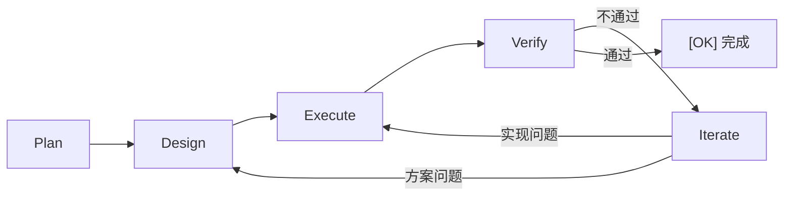

# 核心概念

## 变更 (Change)

一个开发任务就是一个「变更」，例如"添加用户认证"、"修复空指针"。DevCrew 以变更为单位管理开发流程。

## PDEVI 工作流

- **Plan** — PdM 整理需求，明确目标和验收标准
- **Design** — Architect 设计技术方案，任务分解
- **Execute** — Implementer 编码实现
- **Verify** — Tester 测试验证 + Reviewer 代码审查（平行）
- **Iterate** — 不通过时 PjM 协调回退修复

## 文件即记忆

DevCrew 使用文件系统作为持久化记忆，分为两层：

**全局文件**（跨变更）：
- `INSTRUCTIONS.md` — AI 的行为指令
- `dev-crew.yaml` — 项目配置
- `dev-crew/specs/` — 共享规约
- `dev-crew/memory/` — 各 Agent 的长期记忆

**变更级文件**（每个 Agent 各自维护）：
- `proposal.md` — PdM 的需求产出
- `design.md` — Architect 的方案产出
- `impl-log.md` — Implementer 的实现日志
- `test-report.md` — Tester 的验证报告
- `review-report.md` — Reviewer 的审查报告

换窗口、换对话，每个 Agent 读取自己的记忆文件就能恢复上下文。

## Blocker

AI 遇到无法自主决策的问题时，会标记为 Blocker 并等待你的指示。
