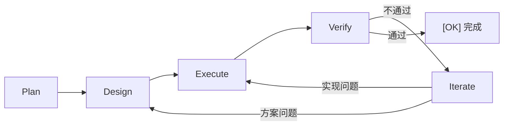

# 核心概念

## 变更 (Change)

一个开发任务就是一个「变更」，例如"添加用户认证"、"修复空指针"。DevCrew 以变更为单位管理开发流程。

## PDEVI 工作流

- **Plan** — 需求整理，明确目标和验收标准
- **Design** — 技术方案设计，任务分解
- **Execute** — 编码实现
- **Verify** — 测试验证 + 代码审查
- **Iterate** — 不通过时自动回退修复

## 文件即记忆

DevCrew 使用文件系统作为持久化记忆：

- `INSTRUCTIONS.md` — AI 的行为指令
- `dev-crew.yaml` — 项目配置
- `dev-crew/specs/` — 共享规约

换窗口、换对话，AI 读取这些文件就能恢复上下文。

## Blocker

AI 遇到无法自主决策的问题时，会标记为 Blocker 并等待你的指示。
