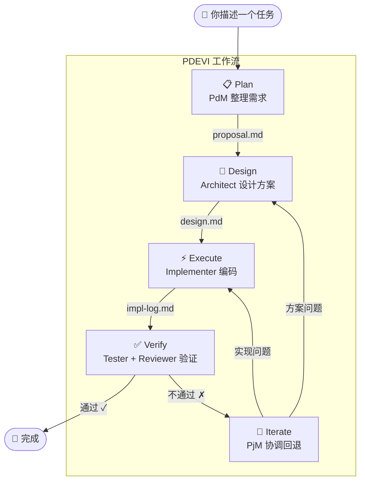
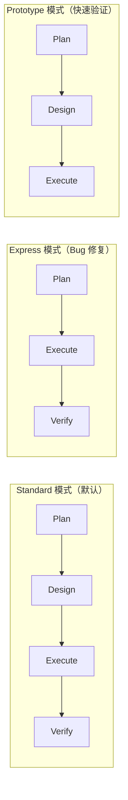

# 核心概念

## 变更 (Change)

一个开发任务就是一个「变更」，例如"添加用户认证"、"修复空指针"。DevCrew 以变更为单位管理开发流程。

## PDEVI 工作流

> 解决的核心问题：AI 做完一大段代码后才发现方向错了，返工成本极高。PDEVI 将开发过程拆成 5 个阶段 + 门禁检查，**每个阶段有明确产出，错了只回退一步**。

每个阶段解决一个具体问题：

| 阶段 | 角色 | 解决什么问题 | 产出文件 |
|------|------|------------|---------|
| **Plan** | PdM | 需求模糊、目标不清 → 明确目标和验收标准 | `proposal.md` |
| **Design** | Architect | 动手就写、方向跑偏 → 先想清楚再动手 | `design.md` |
| **Execute** | Implementer | 大改难追踪 → 按任务分解增量推进 | `impl-log.md` |
| **Verify** | Tester + Reviewer | 改完不测、质量靠运气 → 自动验证和审查 | `test-report.md` `review-report.md` |
| **Iterate** | PjM | 不通过就从头来 → 精准定位回退到该修的阶段 | — |

### 三种模式

不同任务走不同流程，避免小事大做：

- **Standard** — 完整 PDEVI，适合新功能、重构
- **Express** — 跳过 Design，适合 Bug 修复等紧急任务
- **Prototype** — 跳过 Verify，适合快速原型验证

## 文件即记忆

DevCrew 使用文件系统作为持久化记忆，分为两层：

**全局文件**（跨变更）：
- `INSTRUCTIONS.md` — AI 的行为指令
- `dev-crew.yaml` — 项目配置
- `dev-crew/specs/` — 共享规约
- `dev-crew/memory/` — 各 Agent 的长期记忆

**变更级文件**（每个 Agent 各自维护）：
- `proposal.md` — PdM 的需求产出
- `design.md` — Architect 的方案产出
- `impl-log.md` — Implementer 的实现日志
- `test-report.md` — Tester 的验证报告
- `review-report.md` — Reviewer 的审查报告

换窗口、换对话，每个 Agent 读取自己的记忆文件就能恢复上下文。

## Blocker

AI 遇到无法自主决策的问题时，会标记为 Blocker 并等待你的指示。
