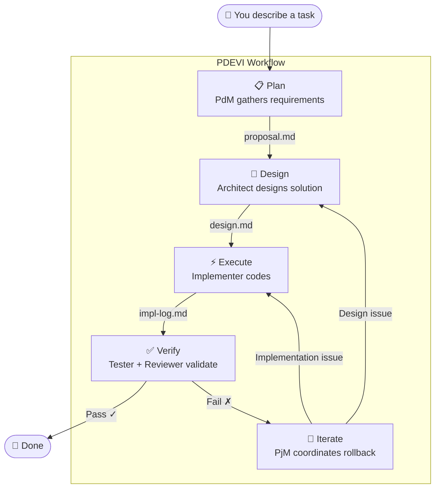
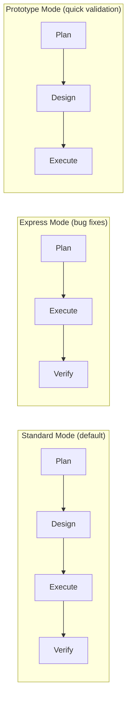

# Core Concepts

## Change

A development task is a "Change" — e.g., "add user authentication" or "fix null pointer". DevCrew manages development flow per change.

## PDEVI Workflow

> Core problem solved: AI writes a large block of code only to discover the direction was wrong — rework cost is huge. PDEVI splits development into 5 phases with gate checks. **Each phase has a clear deliverable; mistakes only roll back one step.**

Each phase solves a specific problem:

| Phase | Role | Problem Solved | Output |
|-------|------|---------------|--------|
| **Plan** | PdM | Vague requirements, unclear goals → define goals & acceptance criteria | `proposal.md` |
| **Design** | Architect | Coding without thinking, drifting direction → think before you build | `design.md` |
| **Execute** | Implementer | Large changes hard to track → incremental progress by task | `impl-log.md` |
| **Verify** | Tester + Reviewer | No testing, quality by luck → automated validation & review | `test-report.md` `review-report.md` |
| **Iterate** | PjM | Failure means start over → precisely roll back to the right phase | — |

### Three Modes

Different tasks use different flows — avoid overkill for simple tasks:

- **Standard** — Full PDEVI, for new features and refactoring
- **Express** — Skips Design, for bug fixes and urgent tasks
- **Prototype** — Skips Verify, for rapid prototype validation

## Files as Memory

DevCrew uses the file system as persistent memory, organized in two layers:

**Global files** (across changes):
- `INSTRUCTIONS.md` — AI behavior instructions
- `dev-crew.yaml` — Project configuration
- `dev-crew/specs/` — Shared specifications
- `dev-crew/memory/` — Each agent's long-term memory

**Per-change files** (each agent maintains their own):
- `proposal.md` — PdM's requirements output
- `design.md` — Architect's technical design
- `impl-log.md` — Implementer's implementation log
- `test-report.md` — Tester's verification report
- `review-report.md` — Reviewer's audit report

Switch windows or conversations — each agent reads its own memory files to restore context.

## Blocker

When AI encounters a decision it can't make autonomously, it marks it as a Blocker and waits for your input.
