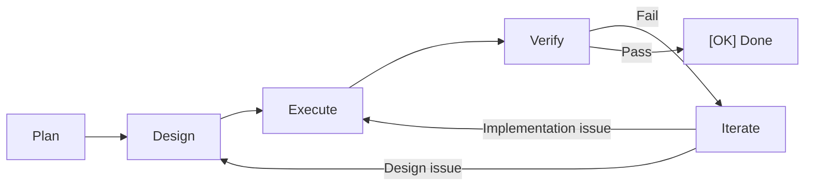

# Core Concepts

## Change

A development task is a "Change" — e.g., "add user authentication" or "fix null pointer". DevCrew manages development flow per change.

## PDEVI Workflow

- **Plan** — PdM gathers requirements, defines goals and acceptance criteria
- **Design** — Architect creates technical design, decomposes tasks
- **Execute** — Implementer writes code
- **Verify** — Tester validates + Reviewer audits code (in parallel)
- **Iterate** — PjM coordinates rollback and fix on failure

## Files as Memory

DevCrew uses the file system as persistent memory, organized in two layers:

**Global files** (across changes):
- `INSTRUCTIONS.md` — AI behavior instructions
- `dev-crew.yaml` — Project configuration
- `dev-crew/specs/` — Shared specifications
- `dev-crew/memory/` — Each agent's long-term memory

**Per-change files** (each agent maintains their own):
- `proposal.md` — PdM's requirements output
- `design.md` — Architect's technical design
- `impl-log.md` — Implementer's implementation log
- `test-report.md` — Tester's verification report
- `review-report.md` — Reviewer's audit report

Switch windows or conversations — each agent reads its own memory files to restore context.

## Blocker

When AI encounters a decision it can't make autonomously, it marks it as a Blocker and waits for your input.
