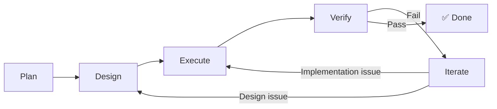

# Core Concepts

## Change

A development task is a "Change" — e.g., "add user authentication" or "fix null pointer". DevCrew manages development flow per change.

## PDEVI Workflow

- **Plan** — Gather requirements, define goals and acceptance criteria
- **Design** — Technical design, task decomposition
- **Execute** — Code implementation
- **Verify** — Testing + code review
- **Iterate** — Auto-rollback and fix on failure

## Files as Memory

DevCrew uses the file system as persistent memory:

- `INSTRUCTIONS.md` — AI behavior instructions
- `devcrew.yaml` — Project configuration
- `devcrew/specs/` — Shared specifications

Switch windows or conversations — AI reads these files to restore context.

## Blocker

When AI encounters a decision it can't make autonomously, it marks it as a Blocker and waits for your input.
